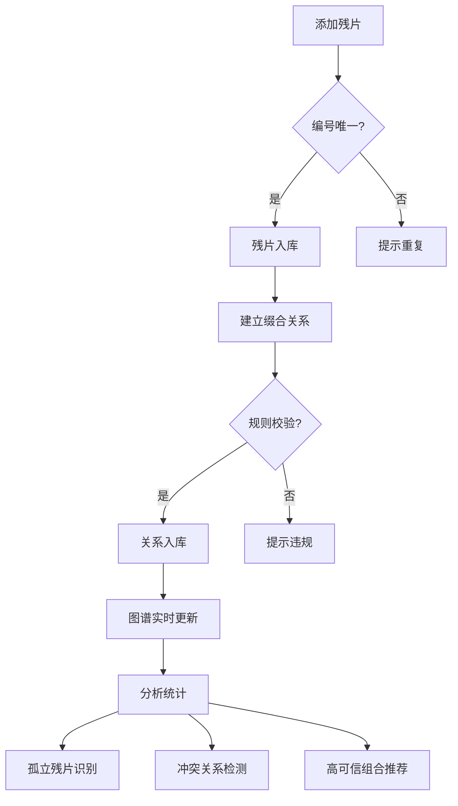

## 1. 产品概述

甲骨残片缀合研究系统是一款面向甲骨学研究人员的专业工具，用于整理和分析甲骨残片之间的缀合关系、文字连续性和边缘吻合度。研究人员可将残片作为节点构建关系图谱，直观展示缀合网络、识别孤立残片、发现冲突关系和高可信组合。

- **目标用户**：甲骨学研究人员、古文字学者、考古工作者
- **核心价值**：数字化管理甲骨残片缀合关系，提供可视化分析能力，提升研究效率和准确性

## 2. 核心功能

### 2.1 用户角色

| 角色 | 注册方式 | 核心权限 |
|------|----------|----------|
| 研究人员 | 本地使用（无注册） | 残片管理、关系管理、图谱浏览、分析统计 |

### 2.2 功能模块

1. **残片管理模块**：添加、编辑、删除残片节点，管理残片编号和基础信息
2. **缀合关系模块**：建立、编辑、删除残片间的缀合关系，设置依据类型、可信度和备注
3. **图谱可视化模块**：以力导向图展示残片节点和缀合关系网络
4. **分析统计模块**：展示孤立残片、冲突关系、高可信组合和已定组情况

### 2.3 页面详情

| 页面名称 | 模块名称 | 功能描述 |
|----------|----------|----------|
| 主工作台 | 残片列表面板 | 展示所有残片列表，支持搜索筛选，可添加新残片 |
| 主工作台 | 关系列表面板 | 展示所有缀合关系列表，支持按类型/可信度筛选 |
| 主工作台 | 图谱可视化区域 | 交互式力导向图，支持拖拽、缩放，点击节点/边查看详情 |
| 主工作台 | 分析统计面板 | 孤立残片统计、冲突关系提示、高可信组合推荐、已定组展示 |

## 3. 核心流程

### 3.1 残片管理流程
研究人员在残片面板中添加新残片，系统校验编号唯一性，添加成功后残片自动显示在图谱和列表中。编辑或删除残片时，系统自动同步更新相关连接。

### 3.2 缀合关系建立流程
研究人员选择两个残片建立缀合关系，系统校验规则（不能自连、不能重复建立同类型关系），通过后设置依据类型、可信度（0-100）和备注，关系自动显示在图谱中。

### 3.3 分析统计流程
系统实时分析残片网络，识别孤立节点、冲突关系（同一对残片存在多条不同结论的关系）、高可信组合（可信度高于阈值的关系组），并展示在统计面板中。

## 4. 用户界面设计

### 4.1 设计风格

- **主色调**：深褐色（#5C4033）搭配米黄色（#F5F0E1），营造古典学术氛围
- **辅助色**：墨青色（#2C3E50）、朱砂红（#C0392B）、青铜绿（#27AE60）
- **按钮风格**：圆角矩形，轻微阴影，悬停有微妙浮起效果
- **字体**：标题使用"Noto Serif SC"衬线字体体现学术古典感，正文使用"Inter"无衬线字体保证可读性
- **布局风格**：三栏布局（左侧列表、中间图谱、右侧统计），卡片式设计，柔和阴影
- **图标风格**：线性简约图标，融入甲骨纹样装饰元素

### 4.2 页面设计概述

| 页面名称 | 模块名称 | UI 元素 |
|----------|----------|---------|
| 主工作台 | 残片列表面板 | 搜索框、添加按钮、残片卡片列表、分页 |
| 主工作台 | 关系列表面板 | 类型筛选、可信度筛选、关系条目列表 |
| 主工作台 | 图谱可视化区域 | 力导向图、缩放控制、图例说明、全屏按钮 |
| 主工作台 | 分析统计面板 | 统计数据卡片、孤立残片列表、冲突关系警示、高可信组合 |

### 4.3 响应性

- 采用桌面端优先设计，主工作台为三栏布局
- 中等屏幕（平板）可折叠侧边栏，图谱区域自适应
- 小屏幕（移动端）切换为标签页式布局，图谱单列展示

### 4.4 交互动效

- 残片节点悬停时放大并显示详情提示
- 建立关系时连线有渐入动画
- 面板切换有平滑过渡效果
- 数据更新时有淡入淡出过渡
