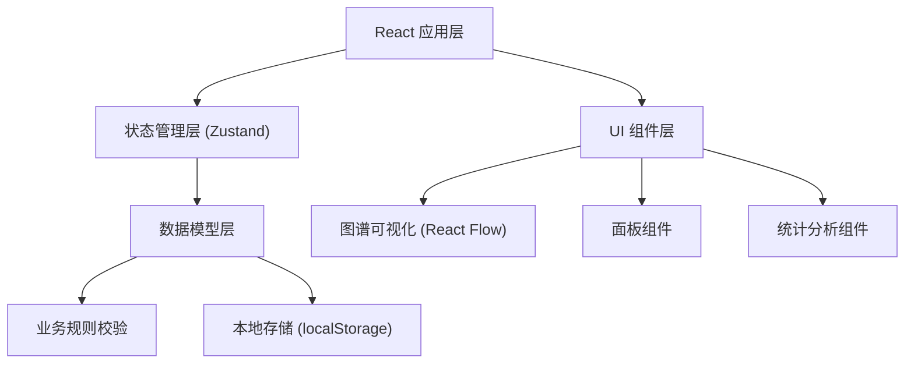
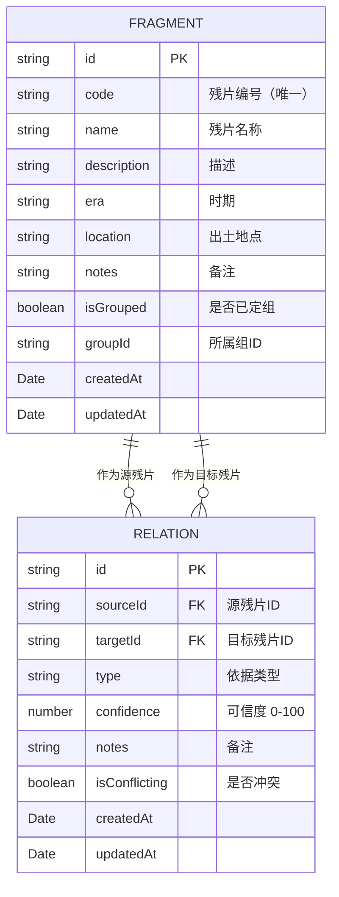

## 1. 架构设计



## 2. 技术描述

- **前端框架**：React 18 + TypeScript + Vite
- **样式方案**：TailwindCSS 3
- **图谱可视化**：React Flow (reactflow)
- **状态管理**：Zustand
- **图标库**：Lucide React
- **数据持久化**：localStorage（纯前端，无需后端）
- **初始化工具**：Vite

## 3. 目录结构

```
src/
├── components/          # 组件目录
│   ├── panels/         # 侧边面板组件
│   │   ├── FragmentListPanel.tsx
│   │   ├── RelationListPanel.tsx
│   │   └── AnalysisPanel.tsx
│   ├── graph/          # 图谱相关组件
│   │   ├── FragmentNode.tsx
│   │   ├── RelationEdge.tsx
│   │   └── GraphCanvas.tsx
│   ├── dialogs/        # 对话框组件
│   │   ├── FragmentDialog.tsx
│   │   └── RelationDialog.tsx
│   └── common/         # 通用组件
├── store/              # 状态管理
│   └── useStore.ts
├── types/              # 类型定义
│   └── index.ts
├── utils/              # 工具函数
│   ├── validation.ts   # 业务规则校验
│   └── analysis.ts     # 分析统计
├── data/               # 示例数据
│   └── mockData.ts
├── App.tsx
├── main.tsx
└── index.css
```

## 4. 数据模型

### 4.1 数据模型定义



### 4.2 核心类型定义

```typescript
// 残片
interface Fragment {
  id: string;
  code: string;
  name: string;
  description: string;
  era?: string;
  location?: string;
  notes?: string;
  isGrouped: boolean;
  groupId?: string;
  createdAt: string;
  updatedAt: string;
}

// 依据类型
enum RelationType {
  EDGE_MATCH = 'edge_match',      // 边缘吻合
  TEXT_CONTINUITY = 'text_continuity', // 文字连续
  CONTENT_ASSOCIATION = 'content_association', // 内容关联
  SHAPE_MATCH = 'shape_match',    // 形状匹配
  OTHER = 'other'                 // 其他
}

// 缀合关系
interface Relation {
  id: string;
  sourceId: string;
  targetId: string;
  type: RelationType;
  confidence: number;
  notes: string;
  createdAt: string;
  updatedAt: string;
}

// 分析统计结果
interface AnalysisResult {
  totalFragments: number;
  totalRelations: number;
  isolatedFragments: Fragment[];
  conflictingRelations: Relation[][];
  highConfidenceRelations: Relation[];
  groupedFragments: Fragment[];
}
```

## 5. 业务规则

### 5.1 残片管理规则
- 残片编号（code）全局唯一，不可重复
- 删除残片时，同步清理所有相关的缀合关系

### 5.2 关系管理规则
- 残片不能与自身建立缀合关系（sourceId !== targetId）
- 同一对残片之间不能重复建立同类型关系（source-target-type 三元组唯一）
- 可信度范围为 0-100 的整数

### 5.3 定组规则
- 存在冲突关系的残片，不能标记为已定组
- 已定组的残片可以组为单位进行管理

### 5.4 分析规则
- **孤立残片**：没有任何缀合关系的残片
- **冲突关系**：同一对残片间存在不同结论的多条关系（通过可信度或备注判断）
- **高可信组合**：可信度高于 80 的缀合关系
- **已定组**：被标记为已定组的残片集合

## 6. 核心功能实现方案

### 6.1 图谱可视化
- 使用 React Flow 实现力导向图布局
- 自定义节点样式：甲骨残片风格的不规则形状
- 自定义连线样式：根据依据类型显示不同颜色
- 支持拖拽、缩放、框选等交互

### 6.2 状态管理
- 使用 Zustand 管理全局状态（残片、关系）
- 状态变更时自动持久化到 localStorage
- 提供选择器优化渲染性能

### 6.3 业务校验
- 封装独立的校验工具函数
- 在添加/编辑操作前进行校验
- 校验失败时给出明确的错误提示
